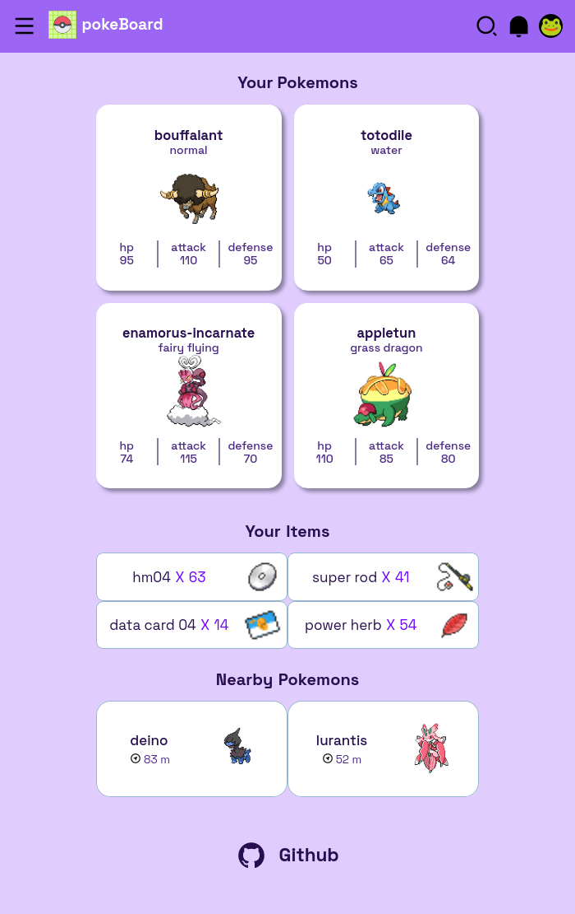
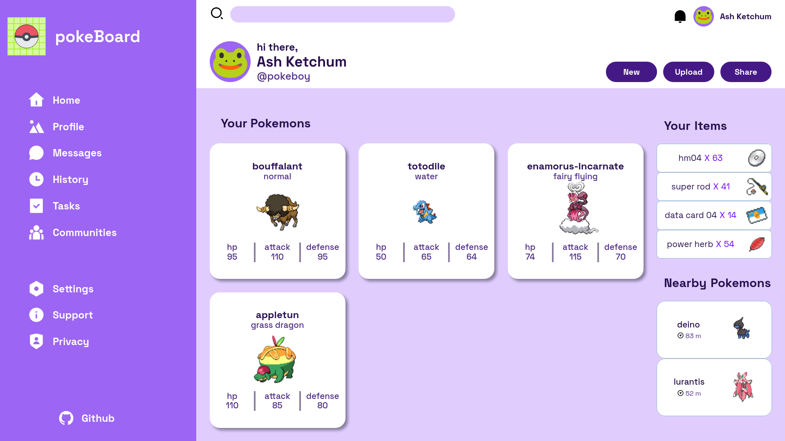

 

 
<h1 align="center">pokeBoard</h1>

**pokeBoard** es una página web responsiva que despliega un dashboard para un entrenador Pokémon, mostrando de forma dinámica Pokémons, items y Pokémons cercanos. Creada con _HTML, CSS, javaScript, git, Inkscape, Penpot y [pokeAPI](https://pokeapi.co/)._

Este proyecto forma parte del plan de estudio de [The Odin Project](https://www.theodinproject.com/lessons/node-path-intermediate-html-and-css-admin-dashboard).

-   [¡Live demo aquí!](https://moramartin99.github.io/pokeBoard/)
-   [¡Prototipo elaborado con _Penpot_ aquí!](https://design.penpot.app/#/view/d5fc0283-ef1c-80fa-8002-327b798f70af?page-id=d5fc0283-ef1c-80fa-8002-327b798f70b0&section=interactions&index=0&share-id=d9665a57-0073-80a2-8002-45934c112be3)

[pokeboard demo HQ.webm](https://github.com/MoraMartin99/pokeBoard/assets/95828792/04d6b7f0-7be9-4587-b983-4e0d791a3827)

<strong>Mobile</strong>

<strong>Tablet</strong>

<strong>Desktop</strong>

## Características

-   **Diseño responsivo**: pensado para móviles, tablets, laptops y desktops.
-   **Diseño autoajustable**: uso de [Fluid Typography](https://chriskirknielsen.com/blog/modern-fluid-typography-with-clamp/), [CSS container queries](https://developer.mozilla.org/en-US/docs/Web/CSS/CSS_container_queries) y [CSS Grid auto-fit](https://css-tricks.com/auto-sizing-columns-css-grid-auto-fill-vs-auto-fit/).
-   **Dinámica**: cada vez que se carga la pagina se muestra información nueva mediante el consumo de [pokeAPI](https://pokeapi.co/).
-   **Accesibilidad**: Implementada con los respectivos atributos de _[Texto alternativo](https://web.dev/labels-and-text-alternatives/)_ en las imágenes, _Rem_ para el texto y _[HTML semántico](https://web.dev/semantics-and-screen-readers/)._
-   **Basada en promesas**: Todo código asíncrono fue implementado con la [Promise API](https://devdocs.io/javascript/global_objects/promise).
